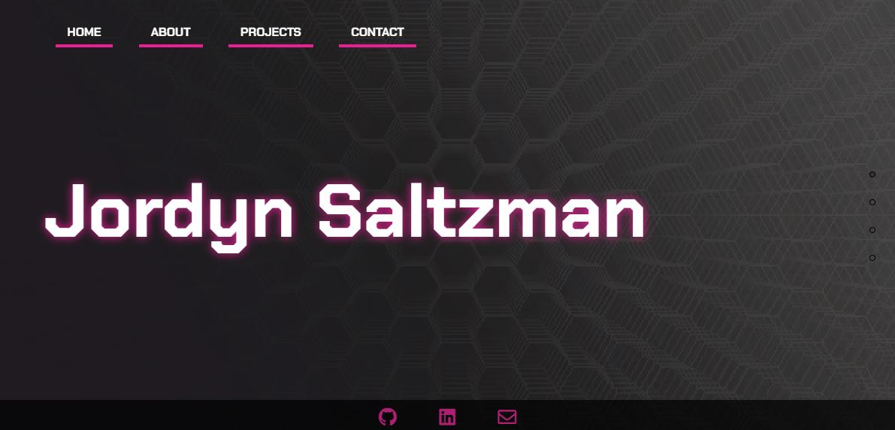

# Portfolio 
### _I now have an updated [React version of my portfolio](https://github.com/jordynsaltzman/react-portfolio)_

## Description
Version 2 of my developer portfolio, created using HTML5, CSS3, JavaScript, [pagePiling.js](https://github.com/alvarotrigo/pagePiling.js), and [anime.js](https://github.com/juliangarnier/anime).

[Visit site](https://jordynsaltzman.github.io/portfolio/)

## Known Issues

- Due to the time constraint of this assignment, my projects page is incomplete. 
- The form on the contact page does not submit. 

## Preview 

